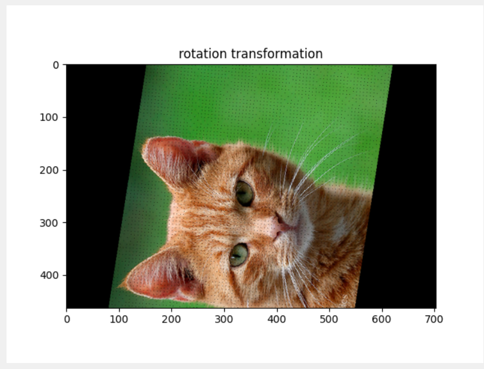
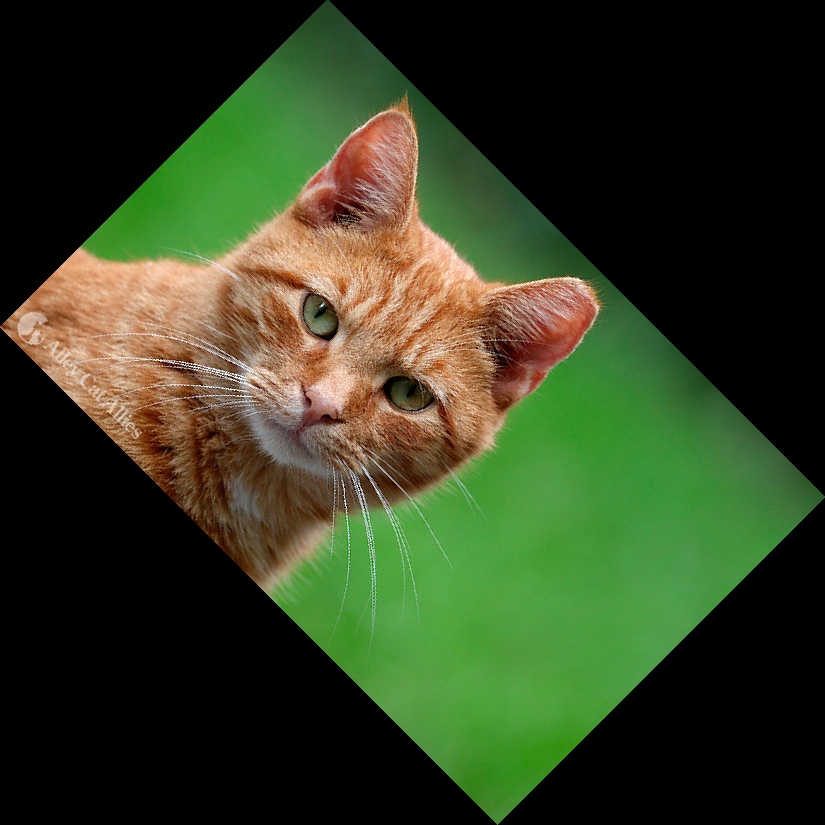

# Various Computer Vision Tasks

This repository contains several computer vision tasks, including line detection on a video input.

To run the code in this repository, install the following packages:

```python
pip install opencv-python numpy matplotlib
```
1. **Image Histogram Generation**
An image histogram is a graphical representation of the distribution of pixel intensities in an image. It shows the frequency of occurrence of each pixel intensity level.

**Applications:**

* **Image Enhancement:** Adjusting the histogram can enhance image contrast and brightness.
* **Image Segmentation:** Identifying regions with similar intensity levels can help in segmenting images.
* **Image Comparison:** Comparing histograms of different images can help in image matching and retrieval.

**2. 2D Transformation on Images**
2D transformations are geometric operations that manipulate the spatial arrangement of pixels in an image. Common transformations include:

* **Rotation:** Rotating an image around a specific point.
* **Translation:** Shifting an image horizontally or vertically.
* **Scaling:** Resizing an image by increasing or decreasing its dimensions.
* **Affine Transformation:** A combination of rotation, translation, and scaling.
* **Skew:** Shearing an image along a particular axis.

**Applications:**

* **Image Registration:** Aligning multiple images to a common coordinate system.
* **Object Tracking:** Tracking the movement of objects in a video sequence.
* **Image Warping:** Distorting an image to create new perspectives or effects.

**3. Canny Edge Detection**
Canny edge detection is a technique for detecting edges in images. It involves several steps:

1. **Noise Reduction:** Smoothing the image to reduce noise.
2. **Gradient Calculation:** Computing the gradient magnitude and direction at each pixel.
3. **Non-Maximum Suppression:** Thinning the edges to one pixel width.r
4. **Double Thresholding:** Classifying edges as strong or weak based on their gradient magnitude.
5. **Edge Tracking by Hysteresis:** Connecting edge segments to form continuous edges.

**Applications:**

* **Object Detection:** Locating objects in images based on their edges.
* **Image Segmentation:** Partitioning images into meaningful regions based on edges.
* **Feature Extraction:** Extracting features for image recognition and classification.


**4. Hough Transformation for Line Detection**
The Hough transform is a technique for detecting lines in images. It involves mapping image points to parameter space, where lines are represented as points. By accumulating votes in parameter space, lines can be detected.

**Applications:**

* **Line Detection:** Finding lines in images, such as road lanes or building edges.
* **Shape Detection:** Detecting shapes like circles, ellipses, or other geometric patterns.
* **Feature Extraction:** Extracting line features for object recognition and classification.

**5. Image Stitching**
Image stitching is the process of combining multiple images into a single panoramic image. It involves:

1. **Feature Detection and Matching:** Identifying corresponding points in overlapping regions of images.
2. **Homography Estimation:** Computing the geometric transformation between images.
3. **Image Warping:** Transforming images to align them with a common reference frame.
4. **Blending:** Combining the warped images to create a seamless panorama.

**Applications:**

* **Creating Panoramic Images:** Combining multiple images to create a wide-angle view.
* **Virtual Reality:** Creating immersive virtual environments.
* **Medical Imaging:** Combining multiple images to create a larger field of view.


### Some Challenges faced and Fixes
Encountered issues with the canvas size and black pixels during rotation and affine transformations which was caused by the improper calculations of the new image dimensions and incomplete pixel mapping. The canvas was either too large or parts of the transformed image were clipped because the bounding box of the transformed image was not correctly calculated. Black pixels appeared due to forward mapping, where not all canvas pixels were filled.

To fix this, the transformed positions of the image corners were calculated to determine the exact bounding box for the new canvas, ensuring a perfect fit. Reverse mapping was used to map each canvas pixel back to the original image, preventing gaps and preserving all image details. These adjustments resolved clipping, eliminated excess canvas space, and minimized black pixel regions, producing accurate and well-aligned transformations. Below is a comparisism of the challenge i faced for the rotation transformation and it result after fixing the issues:

<p align="center">
  
  
</p>


### Line Detection on Video Input
[Watch video](videos/videos.mp4)